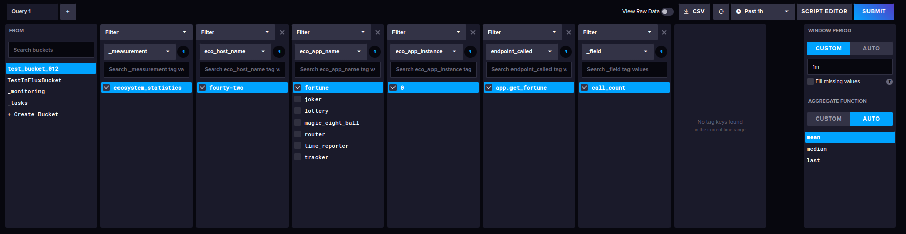
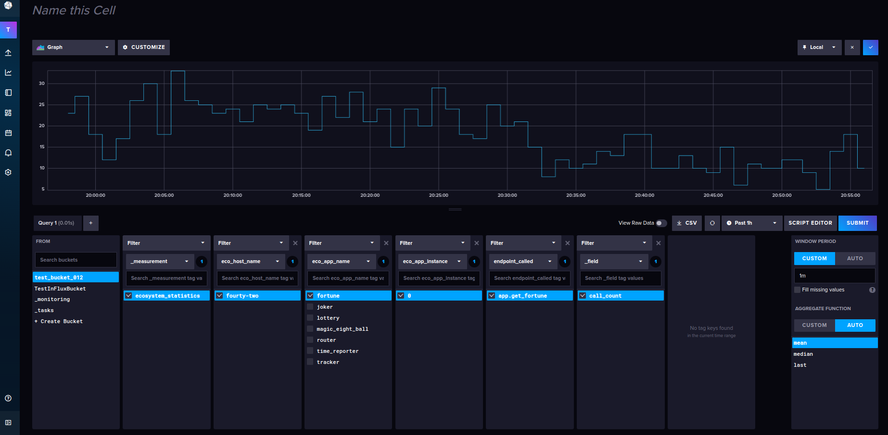
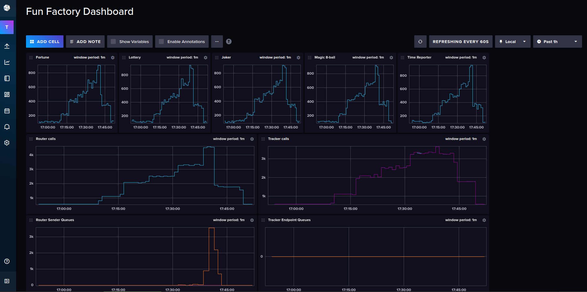

# The fun factory telemetry example

The Ecosystem framework, facilitates real-time telemetry.

This example is just one way of getting your system telemetry, into an
analytics tool.

Of course, this can be solved in any number of ways.
But the basic procedure is:
1. Get the data from your Ecosystem services, on a regular schedule.
2. Give that data to your chosen analytics tool.
3. Set your analytics tool to show the data in some neat graphs.

For this example, I elected to use [InfluxDB](https://www.influxdata.com/), as
the analytics tool.

No, I have no affiliation with [InfluxDB](https://www.influxdata.com/), my
reasons for using it in this example, are as follows:

1. You can run the `influxd` daemon, from your command line. It is a standalone
   binary executable.
2. It has no dependencies, so you don't have to install or configure a separate
   database.
3. The documentation for getting data into [InfluxDB](https://www.influxdata.com/),
   is well written and easy to follow.
   1. There are facilities for achieving this, in several different programming and/or
      scripting languages. Including Python.
4. It is open-source.
5. If you know what you are doing, it is also completely free, as in: "Free Pizza."
6. It does exactly what it claims to do.

The combination of these factors, just made my life easier in terms of putting
together an example for Ecosystem.

Considering the fact that, prior to doing this example, I had no experience with
[InfluxDB](https://www.influxdata.com/). It also serves as demonstration of
exactly how easy it really is, to fulfill this use-case for your employer/business.

Depending on your analytics tool, and your knowledge of Python. This example
can just as easily, be modified to fit into both your organization and your chosen
analytics tool.

Enough about that though, let's get on with the example.

---
## Following the steps.

As mentioned above, the basic procedure with any analytics tool is:
1. Get the data from your system.
2. Feed it to the analytics tool.
3. Set up pretty graphs in the analytics tool.

For this example, we'll need:
1. A running instance of `influxd`
2. Have the [Fun Factory example system](../fun_factory/fun_factory.md) up and running.
3. Have the means to regularly get the telemetry and hand it to `influxd`.
4. Configure the pretty graphs.

So let's break that down:

---
### 1. A running instance of `influxd`
1. Getting influxdb.
   1. You can follow the installation instructions for your system: [InfluxDB installation instructions](https://docs.influxdata.com/influxdb/v2/install/),
   2. I chose to do a manual download and install of the `influxd` binary.
      1. At the time of writing this, I could download it using this link:
         [`influxd` download link](https://download.influxdata.com/influxdb/releases/influxdb2-2.7.6_linux_amd64.tar.gz)
      2. Keep in mind, for me this means I got the Linux AMD64 binary. For you that
         could be different. So visit the
         [InfluxDB installation instructions](https://docs.influxdata.com/influxdb/v2/install/),
         and follow the instructions appropriate to your OS and hardware.
      3. After extracting the compressed file, I could run `influxd` with:
         - `./influxd --reporting-disabled`
2. Now I could go to `http://localhost:8086` in my browser, and set up
   1. a user,
   2. an organization,
   3. a bucket, and most importantly
   4. an API access token.
3. Take note of everything you do in step `2` above. You'll need it later.

---
### 2. Have the [Fun Factory example system](../fun_factory/fun_factory.md) up and running.
Follow the instructs in the documentation for the
[Fun Factory example system](../fun_factory/fun_factory.md),
and set the `[client]` to send one message per second for now.

i.e:
1. Go to the directory you cloned this repository into and
2. Run `python -m examples.fun_factory.router.client 1` from your terminal.

We'll increase the sending speed of `[client]` later, right now we just want to
be sure everything is running.

--------------------------------------------------------------------------------
### 3. Have the means to regularly get the telemetry and hand it to `influxd`.

I like having things neatly organised so:

1. I created a Python script that would get telemetry from **any** Ecosystem
   application, and hand the data to `influxd`. In a neatly tagged structure.
   - In order to run this script, you'll need to have the Python
     `influxdb-client` package installed. I did that with:
     - `pip install influxdb-client`.
   - You can also look at the
     [installation instructions](https://docs.influxdata.com/influxdb/cloud/api-guide/client-libraries/python/)
     provided by InfluxDB.
   - The code for this script can be found in the `examples/telemetry` directory, of
     this repository. The relevant files are:
      - [telemetry_example.py](../../../examples/telemetry/telemetry_example.py) and
      - [argument_parser.py](../../../examples/telemetry/argument_parser.py)
   - You can run this script from the terminal with:
     - `python -m examples.telemetry.telemetry_example -h`
     - When you do this, you'll get neat output to explain what it needs in order to
       get telemetry data from an Ecosystem service, and hand it to InfluxDb.
2. Next I created a bash script that would be run by the cron. This script invokes
   the Python script I created, for each of the components in the
   [Fun Factory example system](../fun_factory/fun_factory.md). The code for this
   script is in: [examples/telemetry/telemetry_cron_script.sh](../../../examples/telemetry/telemetry_cron_script.sh)
   - With this, you'll have to do some work in order to get it right for your system.
     Take a look at the script. Everything you need to change is documented in there.
   - For the sake of completeness, the values you'll have to set before you run that
     script are:
      - `INFLUX_URL`
      - `INFLUX_ORG`
      - `INFLUX_BUCKET`
      - `INFLUX_TOKEN`
3. And then I finish it off, by setting up my cron to call the bash script.
   1. I run `crontab -e`
   2. Then add an entry: `* * * * * /path/to/my/location/for/telemetry_cron_script.sh`

This gets us to the point where we have the telemetry going into our `influxdb` instance.

Now we have to:

---
### 4. Configure the pretty graphs.

- Log into your instance of InfluxDb and go to `Dashboards`
- Click on `CREATE DASHBOARD`
- Click on `ADD CELL`
- Select the bucket you specified in your version of: [examples/telemetry/telemetry_cron_script.sh](../../../examples/telemetry/telemetry_cron_script.sh)
- You'll notice a `_measurement` named `ecosystem_statistics`, select it.
- For your next filter, don't use `_field`, use `eco_host_name`.
  - This is the hostname of the machine your Ecosystem applications are running on.
- Proceed to set up filters with:
  - eco_app_name
  - eco_app_instance
  - endpoint_called
- Finally, select `_field` and `call_count` under it.
- For this example, also set the `WINDOW PERIOD` to be `1m`

Here's what it looked like for me:

When you click on `SUBMIT` you get a nice graph that you can customize.

Here's what I ended up with:

Now you can click on

in the upper right hand corner, and the graph will be added to your dashboard.

By the time I was done setting up graphs for each of the
[Fun Factory example system](../fun_factory/fun_factory.md)
components. Naming everything and organizing it neatly, I had this dashboard:

You can take things further by:
- Clicking on `SET AUTO REFRESH`
- Then on `INDEFINETE`, and
- Select a refresh period of `60s`.
- Make your inactivity timeout `Never` and ...

Watch the graphs update themselves.

And there you have it.

Ecosystem. Real-time Telemetry ... Job! Done!
