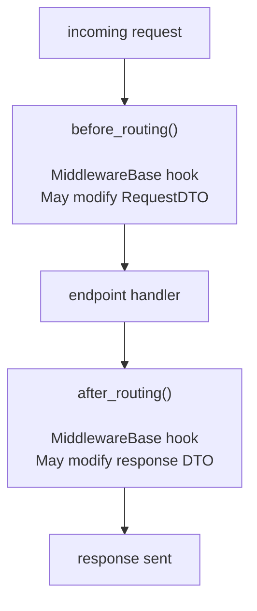
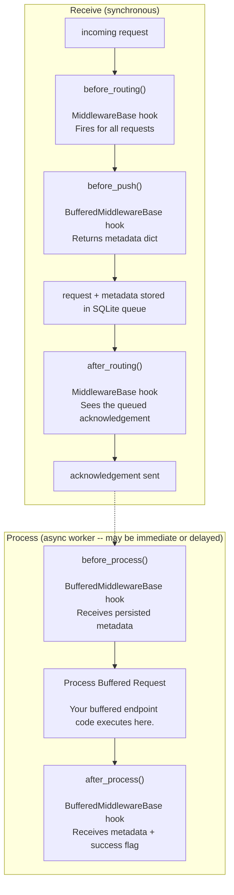

# Middleware

EcoSystem has two middleware systems: one for regular requests and one for buffered endpoints.
They are independent, registered separately, and serve different points in the request lifecycle.

---

## Regular middleware -- MiddlewareBase

Subclass `MiddlewareBase` and override one or both hooks.

```python
from ekosis.middleware import MiddlewareBase
from ekosis.data_transfer_objects import RequestDTO
from pydantic import BaseModel as PydanticBaseModel

class MyMiddleware(MiddlewareBase):
    async def before_routing(self, **kwargs) -> RequestDTO:
        protocol_dto = kwargs["protocol_dto"]
        # inspect or modify the incoming request
        return protocol_dto

    async def after_routing(self, **kwargs) -> PydanticBaseModel:
        response_dto = kwargs["response_dto"]
        # inspect or modify the outgoing response
        return response_dto
```

`before_routing` fires after a request is received, before it is dispatched to an endpoint.
`after_routing` fires after the endpoint returns, before the response is sent.

Both hooks fire for every request regardless of which endpoint handles it -- including
buffered endpoints. For buffered endpoints, `after_routing` sees the immediate queued
acknowledgement, not the eventual processing result.

Both hooks must return the DTO they received (or a replacement). Returning a different object
replaces the DTO for all downstream middleware and the router.

`kwargs` always contains `protocol_dto` (the incoming `RequestDTO`). In `after_routing` it
also contains `response_dto` (the outgoing response DTO).

---

## Registering regular middleware -- MiddlewareManager

`MiddlewareManager` is a singleton. Register middleware once at application startup.

```python
from ekosis.middleware import MiddlewareManager

MiddlewareManager().add(MyMiddleware())
```

Multiple middleware instances chain in registration order. Each hook receives the DTO
returned by the previous middleware in the chain.

---

## Buffered middleware -- BufferedMiddlewareBase

Buffered endpoints queue incoming requests to SQLite and return immediately. By the time
the request is processed, the original async context is gone. `BufferedMiddlewareBase`
bridges that gap via a metadata dict that travels with the queue entry.

Subclass `BufferedMiddlewareBase` and override one or more hooks.

```python
from ekosis.middleware import BufferedMiddlewareBase
from pydantic import BaseModel as PydanticBaseModel
import uuid

class MyBufferedMiddleware(BufferedMiddlewareBase):
    async def before_push(self, uid: uuid.UUID, dto: PydanticBaseModel) -> dict:
        # called when the request is received, before it enters the queue
        # return a dict -- it will be stored with the queue entry and passed to
        # before_process and after_process when the entry is eventually processed
        return {}

    async def before_process(self, uid: uuid.UUID, dto: PydanticBaseModel, metadata: dict, retries: int) -> None:
        # called just before process_buffered_request runs
        # metadata is the dict returned by before_push (survives retries and reprocess)
        pass

    async def after_process(self, uid: uuid.UUID, dto: PydanticBaseModel, metadata: dict, success: bool) -> None:
        # called after processing completes, whether it succeeded or failed
        # success=False means the item will be retried or dead-lettered
        pass
```

### The metadata mechanism

`before_push` returns a dict. `BufferedMiddlewareManager` merges the dicts from all
registered middleware instances and stores the result alongside the queue entry in SQLite.

When a worker picks up the entry -- immediately, on a retry, or after a reprocess -- the
stored metadata is passed to `before_process` and `after_process` unchanged. This is how
context captured at receive time (a trace ID, a timestamp, a correlation value) survives
the async gap to processing time.

Reprocess paths (`move_error_to_pending`) preserve existing metadata -- they do NOT call
`before_push` again. The metadata from the original receive is what travels through the
full lifetime of the queue entry.

---

## Registering buffered middleware -- BufferedMiddlewareManager

`BufferedMiddlewareManager` is a separate singleton from `MiddlewareManager`.

```python
from ekosis.middleware import BufferedMiddlewareManager

BufferedMiddlewareManager().add(MyBufferedMiddleware())
```

Chaining behaviour is the same: hooks run in registration order. For `before_push`, the
returned dicts are merged -- if two middleware instances return the same key, the last one
wins.

---

## Request lifecycle

### Regular endpoint


### Buffered endpoint



---

## Example -- request logging middleware

### The middleware code
```python
import logging
import uuid
import time

from ekosis.middleware         import MiddlewareBase, BufferedMiddlewareBase
from ekosis.middleware         import MiddlewareManager, BufferedMiddlewareManager
from ekosis.data_transfer_objects import RequestDTO
from pydantic                  import BaseModel as PydanticBaseModel

log = logging.getLogger(__name__)


class RequestLogger(MiddlewareBase):
    async def before_routing(self, **kwargs) -> RequestDTO:
        protocol_dto = kwargs["protocol_dto"]
        log.info(f"request uid={protocol_dto.request_uid} route={protocol_dto.route_key}")
        return protocol_dto

    async def after_routing(self, **kwargs) -> PydanticBaseModel:
        response_dto = kwargs["response_dto"]
        protocol_dto = kwargs["protocol_dto"]
        log.info(f"response uid={protocol_dto.request_uid}")
        return response_dto


class BufferedRequestLogger(BufferedMiddlewareBase):
    async def before_push(self, uid: uuid.UUID, dto: PydanticBaseModel) -> dict:
        log.info(f"buffered queued uid={uid}")
        return {"queued_at": time.monotonic()}

    async def before_process(self, uid: uuid.UUID, dto: PydanticBaseModel, metadata: dict, retries: int) -> None:
        log.info(f"buffered processing uid={uid} retries={retries}")

    async def after_process(self, uid: uuid.UUID, dto: PydanticBaseModel, metadata: dict, success: bool) -> None:
        elapsed = time.monotonic() - metadata.get("queued_at", time.monotonic())
        log.info(f"buffered done uid={uid} success={success} queue_time={elapsed:.3f}s")
```

### The application code
```python
from ekosis.application_base import ApplicationBase
from ekosis.middleware       import MiddlewareManager, BufferedMiddlewareManager
from your_import_here        import RequestLogger, BufferedRequestLogger

MiddlewareManager().add(RequestLogger())
BufferedMiddlewareManager().add(BufferedRequestLogger())

# --------------------------------------------------------------------------------
class MyServer(ApplicationBase):
    def __init__(self):
        super().__init__()

# --------------------------------------------------------------------------------
def main():
    with MyServer() as app:
        app.start()

# --------------------------------------------------------------------------------
if __name__ == '__main__':
    main()
```
