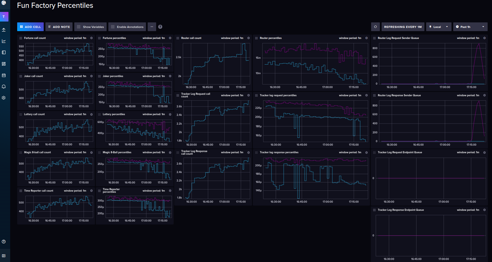

# Statistics (Real-time Telemetry) made easy. 

## Why it exists.

In every single business, one needs to know things like:
- How many times users have interacted with a particular endpoint.
- How long an application has been up.
- How big are queues at any given time.
- And way, way more.

I've seen businesses go to ridiculous lengths to get these kinds of answers from
their systems. To the extent where they resort to log aggregation, or even
transmitting their raw logs to a 3rd party service.

Given how easy it is to just get your applications to report their own telemetry,
I've never seen the point behind either log aggregation or spending money on a
3rd party service for this. Besides, neither of those solutions give you
real-time telemetry.

Once you have an endpoint in an application, that allows you to get its telemetry
on the fly. You can put a real-time analytics solution like
[InfluxDB](https://www.influxdata.com/) in place, and simply feed it the
application's telemetry, through something as simple as a cron job.
And there you go ... Job done!

If you find that hard to believe, here's an image of a dashboard I put
together for the [Fun Factory example](./examples/fun_factory/fun_factory.md).



What you are looking at there, is real-time telemetry, retrieved from an entire
system. It includes the number of times every endpoint in each of the services
was called, as well as the queue sizes for both the `[router]` and `[tracker]`
services.

So. Why not just have telemetry tracking, reporting and an endpoint, in your
applications?

Why waste money on 3rd party services, or live without real-time telemetry, when
all of that could be part of your system already?

## The Ecosystem statistics keeper.

Yes! Ecosystem provides a lot of statistics gathering, out of the box.

Just having an `endpoint` in your application causes Ecosystem to start tracking
data about that endpoint. The same thing happens for `queued_endpoint` and
`queued_sender`.

And no, you don't have to write a single line of code for it! Just the act
of decorating a function with `endpoint`, `queued_endpoint` or `queued_sender`,
does this for you already.

Even the endpoint that allows you to retrieve the telemetry data, already exists!

That end point is: `eco.statistics.get`

---
### The current statistical period
Go ahead, start up the [dice roller example](./examples/dice_roller/dice_roller.md)
and run its [client](./examples/dice_roller/client.md) a dozen or so times.

Then you can use either `netcat`, or the Ecosystem command line tool from your
terminal:

For `netcat` use this command:
```shell
echo '{"route_key": "eco.statistics.get", "data": {"type": "current"}, "uid": "abcdef01-abcd-abcd-abcd-abcdef012345"}' | nc localhost 8888
```

If you don't have `netcat` on your machine, try the Ecosystem command line tool with:

```shell
python -m ecosystem.command_line_tool.cli -st tcp -sd 127.0.0.1:8888 -stat current
```

The output from the Ecosystem command line tool won't be the exact same as the
responses discussed below. All the data will be there though, and it will be
beautified for you.

**Note:** I'm showing protocol level responses in this document, because one will typically
want to use that when writing data to a real-time analytics database, rather than
the responses from a command line tool.

With the raw responses, you'll get something like what we have below, if you put
it through a JSON beautifier of some kind first:

```json
{
   "data" : {
      "statistics" : {
         "endpoint_call_counts" : {
            "dice_roller" : {
               "guess"     : { "call_count" : 20 },
               "roll"      : { "call_count" : 20 },
               "roll_times": { "call_count" : 20 }
            },
            "eco" : {
               "statistics" : {
                  "get" : { "call_count" : 2 }
               }
            }
         },
         "queued_endpoint_sizes" : {
            "dice_roller" : {
               "roll_times" : {
                  "error"    : 32,
                  "incoming" : 0
               }
            }
         },
         "timestamp" : 1719929657,
         "uptime" : 71
      }
   },
   "status" : 0,
   "uid" : "abcdef01-abcd-abcd-abcd-abcdef012345"
}
```

As you can see from this response, I did 20 calls to each of the `dice_roller.guess`,
`dice_roller.roll`, and `dice_roller.roll_times` endpoints

Even the 2 calls I made to `eco.statistics.get` are there.

The sizes of the `incomming` and `error` queue databases for the `dice_roller.roll_times`
queued endpoint, are also there.

`timestamp` is the time at which I made the call to `eco.statistics.get`, and
`uptime` is how many seconds the
[dice roller example](./examples/dice_roller/dice_roller.md) has been running
since I started it up.

Pretty cool, right?

Well, hold on to your hat anyway: This gets better!

---
### The last gathered statistical period

The response you saw above, is just for the current 5-minute period of statistical
gathering.

Allow the [dice roller example](./examples/dice_roller/dice_roller.md) to run
more than 5 minutes, and you'll be able to use this `netcat` command from your terminal:

```shell
echo '{"route_key": "eco.statistics.get", "data": {"type": "gathered"}, "uid": "abcdef01-abcd-abcd-abcd-abcdef012345"}' | nc localhost 8888
```

If you'd rather play with the Ecosystem command line tool, use this:

```shell
python -m ecosystem.command_line_tool.cli -st tcp -sd 127.0.0.1:8888 -stat gathered
```

The response you get, is all the gathered statistics, for the last gathering
period.

The default gathering period for an Ecosystem application, is `300` seconds. i.e.
`5` minutes. You can adjust this by setting the `ECOENV_STAT_GP` environment
variable on your system. For more on that, see the documentation on
[configuration through environment variables](./configuration/through_environment_variables.md).

Moving on though.

Yes, you can use the first `netcat` command I showed you, where `type` is set
to `current`, to get the situation as it is, at the time you execute the command
on your terminal.

The one where `type` is set to `gathered`, gives you the data as it was, for
the 5-minute period before the current 5-minute period.

Here's what I got:

```json
{
   "data" : {
      "statistics" : {
         "endpoint_call_counts" : {
            "dice_roller" : {
               "guess"      : { "call_count" : 0 },
               "roll"       : { "call_count" : 0 },
               "roll_times" : { "call_count" : 0 }
            },
            "eco" : {
               "statistics" : {
                  "get" : { "call_count" : 1 }
               }
            }
         },
         "queued_endpoint_sizes" : {
            "dice_roller" : {
               "roll_times" : {
                  "error"    : 32,
                  "incoming" : 0
               }
            }
         },
         "timestamp" : 1719931174,
         "uptime" : 1588
      }
   },
   "status" : 0,
   "uid" : "abcdef01-abcd-abcd-abcd-abcdef012345"
}
```

You'll notice for that period:
- the only call I made was too `eco.statistics.get`, and
- the error queue for the `dice_roller.roll_times` endpoint, still has `32` entries in it.

In this case, `timestamp` is the unix-timestamp at which this set of statistics
were gathered, and `uptime` is how long the application has been running, at the
time the statistics gathering took place.

If you are impressed by this, you might want to get some tape to hold your hat down.
It gets even better!

---
### The full statistical history.

By default, Ecosystem will keep `12` gathered periods as a history.
i.e. 1-hours worth of gathered statistics.

You can adjust this of course, using the `ECOENV_STAT_HL` environment variable.
Again, see the documentation on
[configuration through environment variables](./configuration/through_environment_variables.md), for more on that.

If you allow the [dice roller example](./examples/dice_roller/dice_roller.md) to
run for about 15 minutes, you'll be able to use this `netcat` command, from your terminal:

```shell
echo '{"route_key": "eco.statistics.get", "data": {"type": "full"}, "uid": "abcdef01-abcd-abcd-abcd-abcdef012345"}' | nc localhost 8888
```

Again, here's the Ecosystem command line tool, equivalent:

```shell
python -m ecosystem.command_line_tool.cli -st tcp -sd 127.0.0.1:8888 -stat full
```

Here's what I got:

```json
{
   "data" : {
      "statistics" : [
         {
            "endpoint_call_counts" : {
               "dice_roller" : {
                  "guess"     : { "call_count" : 0 },
                  "roll"      : { "call_count" : 0 },
                  "roll_times": { "call_count" : 0 }
               },
               "eco" : {
                  "statistics" : {
                     "get" : { "call_count" : 0 }
                  }
               }
            },
            "queued_endpoint_sizes" : {
               "dice_roller" : {
                  "roll_times" : {
                     "error"    : 32,
                     "incoming" : 0
                  }
               }
            },
            "timestamp" : 1719931988,
            "uptime" : 2402
         },
         {
            "endpoint_call_counts" : {
               "dice_roller" : {
                  "guess"      : { "call_count" : 0 },
                  "roll"       : { "call_count" : 0 },
                  "roll_times" : { "call_count" : 0 }
               },
               "eco" : {
                  "statistics" : {
                     "get" : { "call_count" : 0 }
                  }
               }
            },
            "queued_endpoint_sizes" : {
               "dice_roller" : {
                  "roll_times" : {
                     "error"    : 32,
                     "incoming" : 0
                  }
               }
            },
            "timestamp" : 1719931688,
            "uptime" : 2102
         },
         {
            "endpoint_call_counts" : {
               "dice_roller" : {
                  "guess"     : { "call_count" : 0 },
                  "roll"      : { "call_count" : 0 },
                  "roll_times": { "call_count" : 0 }
               },
               "eco" : {
                  "statistics" : {
                     "get" : { "call_count" : 1 }
                  }
               }
            },
            "queued_endpoint_sizes" : {
               "dice_roller" : {
                  "roll_times" : {
                     "error"    : 32,
                     "incoming" : 0
                  }
               }
            },
            "timestamp" : 1719931387,
            "uptime" : 1801
         },
         {
            "endpoint_call_counts" : {
               "dice_roller" : {
                  "guess"     : { "call_count" : 0 },
                  "roll"      : { "call_count" : 0 },
                  "roll_times": { "call_count" : 0 }
               },
               "eco" : {
                  "statistics" : {
                     "get" : { "call_count" : 1 }
                  }
               }
            },
            "queued_endpoint_sizes" : {
               "dice_roller" : {
                  "roll_times" : {
                     "error"    : 32,
                     "incoming" : 0
                  }
               }
            },
            "timestamp" : 1719931087,
            "uptime" : 1501
         },
         {
            "endpoint_call_counts" : {
               "dice_roller" : {
                  "guess"     : { "call_count" : 0 },
                  "roll"      : { "call_count" : 0 },
                  "roll_times": { "call_count" : 0 }
               },
               "eco" : {
                  "statistics" : {
                     "get" : { "call_count" : 0 }
                  }
               }
            },
            "queued_endpoint_sizes" : {
               "dice_roller" : {
                  "roll_times" : {
                     "error"    : 32,
                     "incoming" : 0
                  }
               }
            },
            "timestamp" : 1719930787,
            "uptime" : 1201
         },
         {
            "endpoint_call_counts" : {
               "dice_roller" : {
                  "guess"     : { "call_count" : 0 },
                  "roll"      : { "call_count" : 0 },
                  "roll_times": { "call_count" : 0 }
               },
               "eco" : {
                  "statistics" : {
                     "get" : { "call_count" : 0 }
                  }
               }
            },
            "queued_endpoint_sizes" : {
               "dice_roller" : {
                  "roll_times" : {
                     "error"   : 32,
                     "incoming": 0
                  }
               }
            },
            "timestamp" : 1719930487,
            "uptime" : 901
         },
         {
            "endpoint_call_counts" : {
               "dice_roller" : {
                  "guess"     : { "call_count" : 0 },
                  "roll"      : { "call_count" : 0 },
                  "roll_times": { "call_count" : 0 }
               },
               "eco" : {
                  "statistics" : {
                     "get" : { "call_count" : 0 }
                  }
               }
            },
            "queued_endpoint_sizes" : {
               "dice_roller" : {
                  "roll_times" : {
                     "error"   : 32,
                     "incoming": 0
                  }
               }
            },
            "timestamp" : 1719930186,
            "uptime" : 600
         },
         {
            "endpoint_call_counts" : {
               "dice_roller" : {
                  "guess"     : { "call_count" : 20 },
                  "roll"      : { "call_count" : 20 },
                  "roll_times": { "call_count" : 20 }
               },
               "eco" : {
                  "statistics" : {
                     "get" : { "call_count" : 2 }
                  }
               }
            },
            "queued_endpoint_sizes" : {
               "dice_roller" : {
                  "roll_times" : {
                     "error"   : 32,
                     "incoming": 0
                  }
               }
            },
            "timestamp" : 1719929886,
            "uptime" : 300
         }
      ]
   },
   "status" : 0,
   "uid" : "abcdef01-abcd-abcd-abcd-abcdef012345"
}
```

You'll notice 8 entries there, each one with their details and timestamps of when
they were gathered and all the other data you've seen in the previous sections.

Again:

All of this exists, you don't have to write a single line of code! It's already
there!

If your hat has been bothering you, you might want to take it off at this point
because: It! Gets! Even! Better!

---
### Adding custom statistics

The `StatisticsKeeper` class, is implemented as a singleton, that you can import
into any of your Python modules:

```python
from ecosystem.state_keepers.statistics_keeper import StatisticsKeeper
```

From there you can get an instance of it with:

```python
stats_keeper = StatisticsKeeper()
```

And now you can add your own statistics to your Ecosystem application.

```python
stats_keeper.set_statistic_value("log.this.statistic", 0)
```

Note that the `.` character is special. It allows you to keep groups of statistics.

With this example, when you use one of the `netcat` commands you've seen above.

You'll see it listed as:

```json
"log" : {
  "this" : {
    "statistic": 0
  }
}
```

You can also increment and decrement with:

```python
stats_keeper.increment("log.this.statistic")
stats_keeper.decrement("log.this.statistic")
```

You can even do so with a value:

```python
stats_keeper.increment("log.this.statistic", 5)
stats_keeper.decrement("log.this.statistic", 5)
```

All of this, without resorting to log aggregation, or transmitting logs to 3rd
parties for analysis.

Ecosystem ... Job! Done!
